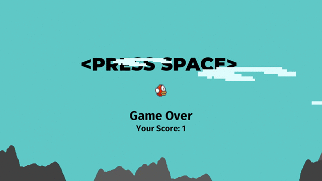

# Flappy Bird Copy use  [Rust](https://www.rust-lang.org/) and [bevy](https://github.com/bevyengine/bevy) 

Just for fun.

I used some image a from [flappy_bevy](https://github.com/TanTanDev/flappy_bevy), thanks.

This is the first time i develper game. Sorry if i have big mistake with my code.   
# License
[WTFPL](https://en.wikipedia.org/wiki/WTFPL)
